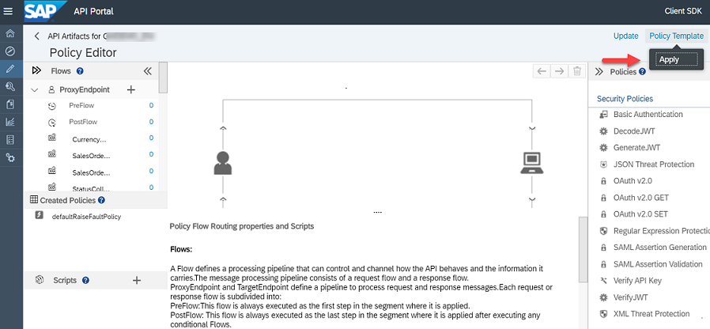

# SAP API Management Policy Template

SAP API Management **Policy Templates** provides the capability to reuse built policies, basically Policy Template is a collection of policies.
We can create policy template based on any scenario, which will help in reducing time and effort by reusing existing policies. 

We have few sample Policy Templates, you can dowlnowd and import Policy Templates in API Management. Policy templates once imported will be  available in your API Management to consume, now open API Proxy & apply the Policy Template, polices will be applied in request or response as per defined Policy Template.

To know more about the Policy Template, how to create, how to use etc, please go to [**SAP API Management Policy Templates**](https://help.hana.ondemand.com/apim_od/frameset.htm?c5d1872acd0746a0ab135fa6dbeef69f.html)

**Sample Policy Templates gitHub repository**

**How to use sample Policy Templates** 

 * Sample Policy Template zips are available in respective policy template respository.
 * Download the zip files, launch API Management and go to the Policy Template tab present in Develop view.
 * Import downloaded Policy Template zips, once policy templates are imported, they are displayed in the Policy Templates tab 

    
		
 
 * Now you want to apply the policy template on the API.
 * Open the API & go to Policy editor in edit-mode.

    

 * Click on the Policy Template & select Apply, list of availabe Policy Templates will be displayed.
 * Slect Policy template & click on Apply, polices present in the template are applied on the pre/post flow as defined.
 * You can also copy Policy template, here all polices will not be applied on the flows but copied in your API.

### API Management Policy Templates
Policy Template|Description
---|---
[API Management debugging and traceability](for/api-management-debugging-and-traceability)|Assists in API proxy execution performance assessment|
[CORS](for/CORS)| Supports your API to be consumed by the application where CORS support is not available|
[Connect to SAP Cloud Foundry services](for/connect-to-sap-cloud-foundry-services)|Helps to manage mircoservices running in cloud foundry using SAP Cloud Platform API Management|
[Connect to SAP Cloud Platform services](for/connect-to-sap-cloud-platform-services)|Helps in consuming APIs hosted on SAP Cloud Platform and protected by Cloud Platform OAuth|
[Connect to SAP Concur](for/connect-to-sap-concur)|Facilitates easy consumption of Concur APIs protected by OAuth|
[Connect to SAP SuccessFactors](for/connect-to-sap-successfactors)| Helps to consume SAP SuccessFactors APIs protected by OAuth|
[JSON Threat Protection](for/json-threat-protection)|Assists you in securing your APIs from JSON threats for APIs managed by API Management|
[Metadata Cache for Odata APIs](for/metadata-cache-for-odata-apis)|Helps to improve performance of Odata API Proxies by caching metadata across invocations|
[Principal propagation via SAML](for/principal-propagation-via-saml)|Assists you in SAML User propagation from the application to back-end system via SAP API Management|
[Quota With 429 Status Code](for/quota-with-429-status-code)|Helps to set quota and 429 status message|
[SQL Threat Protection](for/sql-threat-protection)|Assists you in securing your APIs from SQL threat for APIs managed by API Management|
[URL Masking](for/url-masking)|Assists in protecting backend system for APIs managed by API Management|
[Verify APIKey](for/verify-api-key)|Assists you in protecting APIs by Verifying the API Key |
[XML Threat Protection](for/xml-threat-protection)|Protects APIs from XML threats for APIs managed by API Management|